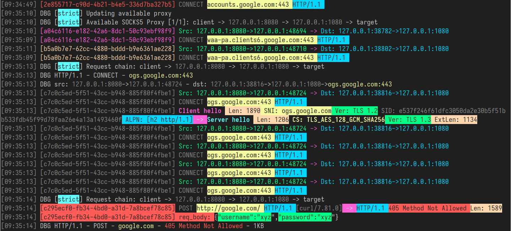

# GoHPTS - HTTP(S) and TCP/UDP transparent proxy to SOCKS5 proxy (chain) written in Go

[](https://www.gnu.org/licenses/gpl-3.0)
[](https://pkg.go.dev/github.com/shadowy-pycoder/go-http-proxy-to-socks)

[](https://goreportcard.com/report/github.com/shadowy-pycoder/go-http-proxy-to-socks)


<p align="center">

## Table of contents

- [Introduction](#introduction)
- [Features](#features)
- [Installation](#installation)
- [Usage](#usage)
  - [Configuration via CLI flags](#configuration-via-cli-flags)
  - [Configuration via YAML file](#configuration-via-yaml-file)
- [Transparent proxy](#transparent-proxy)
  - [redirect (via NAT and SO_ORIGINAL_DST)](#redirect-via-nat-and-so_original_dst)
  - [tproxy (via MANGLE and IP_TRANSPARENT)](#tproxy-via-mangle-and-ip_transparent)
  - [ARP spoofing](#arp-spoofing)
  - [UDP support](#udp-support)
  - [Android support](#android-support)
- [Traffic sniffing](#traffic-sniffing)
  - [JSON format](#json-format)
  - [Colored format](#colored-format)
- [Links](#links)
- [Contributing](#contributing)
- [License](#license)

## Introduction

[[Back]](#table-of-contents)

`GoHPTS` CLI tool is a bridge between HTTP clients and a SOCKS5 proxy server or multiple servers (chain). It listens locally as an HTTP proxy, accepts standard HTTP
or HTTPS (via CONNECT) requests and forwards the connection through a SOCKS5 proxy. Inspired by [http-proxy-to-socks](https://github.com/oyyd/http-proxy-to-socks) and [Proxychains](https://github.com/rofl0r/proxychains-ng)

Possible use case: you need to connect to external API via Postman, but this API only available from some remote server.
The following commands will help you to perform such a task:

Create SOCKS5 proxy server via `ssh`:

```shell
ssh <remote server> -D 1080 -Nf
```

Create HTTP-to-SOCKS5 connection with `gohpts`

```shell
gohpts -s :1080 -l :8080
```

Specify http server in proxy configuration of Postman

## Features

[[Back]](#table-of-contents)

- **Proxy Chain functionality**\
  Supports `strict`, `dynamic`, `random`, `round_robin` chains of SOCKS5 proxy

- **Transparent proxy**\
  Supports `redirect` (SO_ORIGINAL_DST) and `tproxy` (IP_TRANSPARENT) modes

- **TCP and UDP Transparent proxy**\
  `tproxy` (IP_TRANSPARENT) handles TCP and UDP traffic

- **Traffic sniffing**\
  Proxy is able to parse HTTP headers, TLS handshake, DNS messages and more

- **ARP spoofing**\
  Proxy entire subnets with ARP spoofing approach

- **DNS Leak Protection**\
  DNS resolution occurs on SOCKS5 server side.

- **CONNECT Method Support**\
  Supports HTTP CONNECT tunneling, enabling HTTPS and other TCP-based protocols.

- **Trailer Headers Support**\
  Handles HTTP trailer headers

- **Chunked Transfer Encoding**\
  Handles chunked and streaming responses

- **SOCKS5 Authentication Support**\
  Supports username/password authentication for SOCKS5 proxies.

- **HTTP Authentication Support**\
  Supports username/password authentication for HTTP proxy server.

- **Lightweight and Fast**\
  Designed with minimal overhead and efficient request handling.

- **Cross-Platform**\
  Compatible with all major operating systems.

## Installation

[[Back]](#table-of-contents)

You can download the binary for your platform from [Releases](https://github.com/shadowy-pycoder/go-http-proxy-to-socks/releases) page.

Example:

```shell
GOHPTS_RELEASE=v1.11.1; wget -v https://github.com/shadowy-pycoder/go-http-proxy-to-socks/releases/download/$GOHPTS_RELEASE/gohpts-$GOHPTS_RELEASE-linux-amd64.tar.gz -O gohpts && tar xvzf gohpts && mv -f gohpts-$GOHPTS_RELEASE-linux-amd64 gohpts && ./gohpts -h
```

Alternatively, you can install it using `go install` command (requires Go [1.24](https://go.dev/doc/install) or later):

```shell
CGO_ENABLED=0 go install -ldflags "-s -w" -trimpath github.com/shadowy-pycoder/go-http-proxy-to-socks/cmd/gohpts@latest
```

This will install the `gohpts` binary to your `$GOPATH/bin` directory.

Another alternative is to build from source:

```shell
git clone https://github.com/shadowy-pycoder/go-http-proxy-to-socks.git
cd go-http-proxy-to-socks
make build
./bin/gohpts
```

## Usage

[[Back]](#table-of-contents)

```shell
gohpts -h
   _____       _    _ _____ _______ _____
  / ____|     | |  | |  __ \__   __/ ____|
 | |  __  ___ | |__| | |__) | | | | (___
 | | |_ |/ _ \|  __  |  ___/  | |  \___ \
 | |__| | (_) | |  | | |      | |  ____) |
  \_____|\___/|_|  |_|_|      |_| |_____/

GoHPTS (HTTP(S) Proxy to SOCKS5 proxy) by shadowy-pycoder
GitHub: https://github.com/shadowy-pycoder/go-http-proxy-to-socks

Usage: gohpts [OPTIONS]
OPTIONS:
  General:
  -h        Show this help message and exit
  -v        Show version and build information
  -D        Run as a daemon (provide -logfile to see logs)
  -I        Display list of network interfaces and exit

  Proxy:
  -l        Address of HTTP proxy server (Default: "127.0.0.1:8080")
  -s        Address of SOCKS5 proxy server (Default: "127.0.0.1:1080")
  -c        Path to certificate PEM encoded file
  -k        Path to private key PEM encoded file
  -U        User for HTTP proxy (basic auth). This flag invokes prompt for password (not echoed to terminal)
  -u        User for SOCKS5 proxy authentication. This flag invokes prompt for password (not echoed to terminal)
  -i        Bind proxy to specific network interface (either by interface name or index)
  -f        Path to server configuration file in YAML format (overrides proxy flags above)

  Logs:
  -d        Show logs in DEBUG mode
  -j        Show logs in JSON format
  -logfile  Log file path (Default: stdout)
  -nocolor  Disable colored output for logs (no effect if -j flag specified)
  -pprof    Address of pprof server with profiling data

  Sniffing:
  -sniff    Enable traffic sniffing for HTTP and TLS
  -snifflog Sniffed traffic log file path (Default: the same as -logfile)
  -body     Collect request and response body for HTTP traffic (credentials, tokens, etc)

  TProxy:
  -t        Address of transparent proxy server (it starts along with HTTP proxy server)
  -T        Address of transparent proxy server (no HTTP)
  -Tu       Address of transparent UDP proxy server
  -M        Transparent proxy mode: (redirect, tproxy)
  -w        Number of instances of transparent proxy server (Default: number of CPU cores)
  -wu       Number of instances of transparent UDP proxy server (Default: number of CPU cores)
  -auto     Automatically setup iptables for transparent proxy (requires elevated privileges)
  -arpspoof Enable ARP spoof proxy for selected targets (Example: "targets 10.0.0.1,10.0.0.5-10,192.168.1.*,192.168.10.0/24;fullduplex false;debug true")
  -mark     Set mark for each packet sent through transparent proxy (Default: redirect 0, tproxy 100)
  -P        Comma separated list of ports to ignore when proxying traffic (Example: "22,80,443,9092")
```

### Configuration via CLI flags

[[Back]](#table-of-contents)

```shell
gohpts -s 1080 -l 8080 -d -j
```

Output:

```shell
{"level":"info","time":"2025-05-28T06:15:18+00:00","message":"SOCKS5 Proxy: :1080"}
{"level":"info","time":"2025-05-28T06:15:18+00:00","message":"HTTP Proxy: :8080"}
{"level":"debug","time":"2025-05-28T06:15:22+00:00","message":"HTTP/1.1 - CONNECT - www.google.com:443"}
```

Specify username and password for SOCKS5 proxy server:

```shell
gohpts -s 1080 -l 8080 -d -j -u user
SOCKS5 Password: #you will be prompted for password input here
```

Specify username and password for HTTP proxy server:

```shell
gohpts -s 1080 -l 8080 -d -j -U user
HTTP Password: #you will be prompted for password input here
```

When both `-u` and `-U` are present, you will be prompted twice

Run http proxy over TLS connection

```shell
gohpts -s 1080 -l 8080 -c "path/to/certificate" -k "path/to/private/key"
```

Run proxy as a daemon (logfile is needed for logging output, otherwise you will see nothing)

```shell
gohpts -D -logfile /tmp/gohpts.log
```

```shell
# output
gohpts pid: <pid>
```

```shell
# kill the process
kill <pid>
#or
kill $(pidof gohpts)
```

`-u` and `-U` flags do not work in a daemon mode (and therefore authentication), but you can provide a config file (see below)

### Configuration via YAML file

[[Back]](#table-of-contents)

Run http proxy in SOCKS5 proxy chain mode (specify server settings via YAML configuration file)

```shell
gohpts -f "path/to/proxychain/config" -d -j
```

Config example:

```yaml
# Explanations for chains taken from /etc/proxychains4.conf

# strict - Each connection will be done via chained proxies
# all proxies chained in the order as they appear in the list
# all proxies must be online to play in chain

# dynamic - Each connection will be done via chained proxies
# all proxies chained in the order as they appear in the list
# at least one proxy must be online to play in chain
# (dead proxies are skipped)

# random - Each connection will be done via random proxy
# (or proxy chain, see  chain_len) from the list.
# this option is good to test your IDS :)

# round_robin - Each connection will be done via chained proxies
# of chain_len length
# all proxies chained in the order as they appear in the list
# at least one proxy must be online to play in chain
# (dead proxies are skipped).
# the start of the current proxy chain is the proxy after the last
# proxy in the previously invoked proxy chain.
# if the end of the proxy chain is reached while looking for proxies
# start at the beginning again.
# These semantics are not guaranteed in a multithreaded environment.

chain:
  type: strict # dynamic, strict, random, round_robin
  length: 2 # maximum number of proxy in a chain (works only for random chain and round_robin chain)
proxy_list:
  - address: 127.0.0.1:1080
    username: username # username and password are optional
    password: password
  - address: 127.0.0.1:1081
  - address: :1082 # empty host means localhost
server:
  address: 127.0.0.1:8080 # the only required field in this section (ignored when -T flag specified)
  interface: "eth0" # if specified, overrides server address
  # these are for adding basic authentication
  username: username
  password: password
  # comment out these to use HTTP instead of HTTPS
  cert_file: ~/local.crt
  key_file: ~/local.key
```

To learn more about proxy chains visit [Proxychains Github](https://github.com/rofl0r/proxychains-ng)

## Transparent proxy

[[Back]](#table-of-contents)

> Also known as an `intercepting proxy`, `inline proxy`, or `forced proxy`, a transparent proxy intercepts normal application layer communication without requiring any special client configuration. Clients need not be aware of the existence of the proxy. A transparent proxy is normally located between the client and the Internet, with the proxy performing some of the functions of a gateway or router
>
> -- _From [Wiki](https://en.wikipedia.org/wiki/Proxy_server)_

This functionality available only on Linux systems and Android (arm64) and requires additional setup (`iptables`, ip route, etc)

`-T address` flag specifies the address of transparent proxy server (`GoHPTS` will be running without HTTP server).

`-t address` flag specifies the address of transparent proxy server (`HTTP` proxy and other functionality stays the same).

In other words, `-T` spins up a single server, but `-t` two servers, `http` and `tcp`.

There are two modes `redirect` and `tproxy` that can be specified with `-M` flag

## `redirect` (via _NAT_ and _SO_ORIGINAL_DST_)

In this mode proxying happens with `iptables` `nat` table and `REDIRECT` target. Host of incoming packet changes to the address of running `redirect` transparent proxy, but it also contains original destination that can be retrieved with `getsockopt(SO_ORIGINAL_DST)`

To run `GoHPTS` in this mode you use `-t` or `-T` flags with `-M redirect`

### Example

```shell
# run the proxy
gohpts -s 1080 -t 1090 -M redirect -d
```

```shell
# run socks5 server on 127.0.0.1:1080
ssh remote -D 1080 -Nf
```

Setup your operating system:

```shell
# commands below require elevated privileges (you can run it with `sudo -i`)

#enable ip forwarding
sysctl -w net.ipv4.ip_forward=1

# create `GOHPTS` nat chain
iptables -t nat -N GOHPTS

# set no redirection rules for local, http proxy, ssh and redirect procy itself
iptables -t nat -A GOHPTS -d 127.0.0.0/8 -j RETURN
iptables -t nat -A GOHPTS -p tcp --dport 8080 -j RETURN
iptables -t nat -A GOHPTS -p tcp --dport 1090 -j RETURN
iptables -t nat -A GOHPTS -p tcp --dport 22 -j RETURN

# redirect traffic to transparent proxy
iptables -t nat -A GOHPTS -p tcp -j REDIRECT --to-ports 1090

# setup prerouting by adding our proxy
iptables -t nat -A PREROUTING -p tcp -j GOHPTS

# intercept local traffic for testing
iptables -t nat -A OUTPUT -p tcp -j GOHPTS
```

Test connection:

```shell
#traffic should be redirected via 127.0.0.1:1090
curl http://example.com
```

```shell
#traffic should be redirected via 127.0.0.1:8080
curl --proxy http://127.0.0.1:8080 http://example.com
```

Undo everything:

```shell
sysctl -w net.ipv4.ip_forward=0
iptables -t nat -D PREROUTING -p tcp -j GOHPTS
iptables -t nat -D OUTPUT -p tcp -j GOHPTS
iptables -t nat -F GOHPTS
iptables -t nat -X GOHPTS
```

### Auto configuration for `redirect` mode

[[Back]](#table-of-contents)

To configure your system automatically, run the following command:

```shell
sudo env PATH=$PATH gohpts -d -T 8888 -M redirect -auto
```

Please note, automatic configuration requires `sudo` and is very generic, which might not be suitable for your needs.

You can optionally specify `-mark <value>` to prevent possible proxy loops

```shell
sudo env PATH=$PATH gohpts -d -T 8888 -M redirect -auto -mark 100
```

## `tproxy` (via _MANGLE_ and _IP_TRANSPARENT_)

[[Back]](#table-of-contents)

In this mode proxying happens with `iptables` `mangle` table and `TPROXY` target. Transparent proxy sees destination address as is, it is not being rewrited by the kernel. For this to work the proxy binds with socket option `IP_TRANSPARENT`, `iptables` intercepts traffic using TPROXY target, routing rules tell marked packets to go to the local proxy without changing their original destination.

This mode requires elevated privileges to run `GoHPTS`. You can do that by running the follwing command:

```shell
sudo setcap 'cap_net_admin+ep' ~/go/bin/gohpts
```

To run `GoHPTS` in this mode you use `-t` or `-T` flags with `-M tproxy`

### Example

```shell
# run the proxy
gohpts -s 1080 -T 0.0.0.0:1090 -M tproxy -d
```

```shell
# run socks5 server on 127.0.0.1:1080
ssh remote -D 1080 -Nf
```

Setup your operating system:

```shell
ip netns exec ns-client ip route add default via 10.0.0.1
sysctl -w net.ipv4.ip_forward=1

iptables -t mangle -A PREROUTING -i veth1 -p tcp -j TPROXY --on-port 1090 --tproxy-mark 0x1/0x1

ip rule add fwmark 1 lookup 100
ip route add local 0.0.0.0/0 dev lo table 100
```

Test connection:

```shell
ip netns exec ns-client curl http://1.1.1.1
```

Undo everything:

```shell
sysctl -w net.ipv4.ip_forward=0
iptables -t mangle -F
ip rule del fwmark 1 lookup 100
ip route flush table 100
ip netns del ns-client
ip link del veth1
```

### Auto configuration for `tproxy` mode

[[Back]](#table-of-contents)

To configure your system automatically, run the following command (for example, on a separate VM):

```shell
ssh remote -D 1080 -Nf
sudo env PATH=$PATH gohpts -d -T 8888 -M tproxy -auto -mark 100
```

Run the following on your host:

```shell
ip route show default > /tmp/default-route.txt

ip route add 0.0.0.0/1 via 192.168.0.1 # change with ip of your VM
ip route add 128.0.0.0/1 via 192.168.0.1
```

Test connection:

```shell
curl http://example.com #check logs on your VM
```

Undo everything:

```shell
ip route del 0.0.0.0/1 via 192.168.0.1 2>/dev/null || true
ip route del 128.0.0.0/1 via 192.168.0.1 2>/dev/null || true

if [[ -f /tmp/default-route.txt ]]; then
    eval $(awk '{print "ip route add "$0}' /tmp/default-route.txt)
    rm -f /tmp/default-route.txt
else
    echo "Something went wrong"
fi
```

### ARP spoofing

[[Back]](#table-of-contents)

`GoHPTS` has in-built ARP spoofer that can be used to make all TCP talking devices of your LAN to use proxy server to connect to the Internet.
This is achieved by adding `-arpspoof` flag with couple of parameters, separated by semicolon.

Example:

```shell
ssh remote -D 1080 -Nf
sudo env PATH=$PATH gohpts -d -T 8888 -M tproxy -sniff -body -auto -mark 100 -arpspoof "targets 192.168.10.0/24;fullduplex true;debug true"
```

Proxy will scan for devices in subnet `192.168.10.0/24` and send them ARP packets to pretend to be a gateway, if `fullduplex` is true,
proxy will send ARP packets to gateway as well to make it believe our proxy has each IP on the subnet.

After proxy is stopped with `Ctrl+C`, it will automatically unspoof all targets.

`GoHPTS` can also be used with tools like [Bettercap](https://github.com/bettercap/bettercap) to proxy ARP spoofed traffic.

Run the proxy:

```shell
ssh remote -D 1080 -Nf
sudo env PATH=$PATH gohpts -d -T 8888 -M tproxy -sniff -body -auto -mark 100
```

Run `bettercap` with this command (see [documentation](https://www.bettercap.org/)):

```shell
sudo bettercap -eval "net.probe on;net.recon on;set arp.spoof.fullduplex true;arp.spoof on"
```

Check proxy logs for traffic from other devices from your LAN

### UDP support

[[Back]](#table-of-contents)

`GoHPTS` has UDP support that can be enabled in `tproxy` mode. For this setup to work you need to connect to a socks5 server capable of serving UDP connections (`UDP ASSOCIATE`). For example, you can use [https://github.com/wzshiming/socks5](https://github.com/wzshiming/socks5) to deploy UDP capable socks5 server on some remote or local machine. Once you have the server to connect to, run the following command:

```shell
sudo env PATH=$PATH gohpts -s remote -Tu :8989 -M tproxy -auto -mark 100 -d
```

This command will configure your operating system and setup server on `0.0.0.0:8989` address.

To test it locally, you can combine UDP transparent proxy with `-arpspoof` flag. For example:

1. Setup VM on your system with any Linux distributive that supports `tproxy` (Kali Linux, for instance).
2. Enable `bridged` network so that VM could access your host machine.
3. Move `gohpts` binary to VM (via `ssh`, for instance) or build it there in case of different OS/arch.
4. On your VM run the following command:

```shell
# Do not forget to replace <socks5 server> and <your host> with actual addresses
sudo ./gohpts -s <socks5 server> -T 8888 -Tu :8989 -M tproxy -sniff -body -auto -mark 100 -d -arpspoof "targets <your host>;fullduplex true;debug false"
```

5. Check connection on your host machine, the traffic should go through Kali machine.

### Android support

Transparent proxy can be enabled on Android devices (arm64) with root access. You can install [Termux](https://github.com/termux/termux-app) and run `GoHPTS` as a CLI tool there:

```shell
# you need to root your device first
pkg install tsu iproute2
# Android support added in v1.10.2
GOHPTS_RELEASE=v1.10.2; wget -v https://github.com/shadowy-pycoder/go-http-proxy-to-socks/releases/download/$GOHPTS_RELEASE/gohpts-$GOHPTS_RELEASE-android-arm64.tar.gz -O gohpts && tar xvzf gohpts && mv -f gohpts-$GOHPTS_RELEASE-android-arm64 gohpts && ./gohpts -h
# use your phone as router for LAN devices redirecting their traffic to remote socks5 server
sudo ./gohpts -s remote -t 8888 -Tu :8989 -M tproxy -sniff -body -auto -mark 100 -d -arpspoof "fullduplex true;debug false"
```

## Traffic sniffing

[[Back]](#table-of-contents)

`GoHPTS` proxy allows one to capture and monitor traffic that goes through the service. This procces is known as `traffic sniffing`, `packet sniffing` or just `sniffing`. In particular, proxy tries to identify whether it is a plain text (HTTP) or TLS traffic, and after identification is done, it parses request/response metadata and writes it to the file or console. In the case of `GoHTPS` proxy a parsed metadata looks like the following (TLS Handshake):

### JSON format

```json
[
  {
    "connection": {
      "tproxy_mode": "redirect",
      "src_local": "127.0.0.1:8888",
      "src_remote": "192.168.0.107:51142",
      "dst_local": "127.0.0.1:56256",
      "dst_remote": "127.0.0.1:1080",
      "original_dst": "216.58.209.206:443"
    }
  },
  {
    "tls_request": {
      "sni": "www.youtube.com",
      "type": "Client hello (1)",
      "version": "TLS 1.2 (0x0303)",
      "session_id": "2670a6779b4346e5e84d46890ad2aaf7a53b08adcfe0c9f6868c2d9882242e39",
      "cipher_suites": [
        "TLS_AES_128_GCM_SHA256 (0x1301)",
        "TLS_CHACHA20_POLY1305_SHA256 (0x1303)",
        "TLS_AES_256_GCM_SHA384 (0x1302)",
        "TLS_ECDHE_ECDSA_WITH_AES_128_GCM_SHA256 (0xc02b)",
        "TLS_ECDHE_RSA_WITH_AES_128_GCM_SHA256 (0xc02f)",
        "TLS_ECDHE_ECDSA_WITH_CHACHA20_POLY1305_SHA256 (0xcca9)",
        "TLS_ECDHE_RSA_WITH_CHACHA20_POLY1305_SHA256 (0xcca8)",
        "TLS_ECDHE_ECDSA_WITH_AES_256_GCM_SHA384 (0xc02c)",
        "TLS_ECDHE_RSA_WITH_AES_256_GCM_SHA384 (0xc030)",
        "TLS_ECDHE_ECDSA_WITH_AES_256_CBC_SHA (0xc00a)",
        "TLS_ECDHE_ECDSA_WITH_AES_128_CBC_SHA (0xc009)",
        "TLS_ECDHE_RSA_WITH_AES_128_CBC_SHA (0xc013)",
        "TLS_ECDHE_RSA_WITH_AES_256_CBC_SHA (0xc014)",
        "TLS_RSA_WITH_AES_128_GCM_SHA256 (0x9c)",
        "TLS_RSA_WITH_AES_256_GCM_SHA384 (0x9d)",
        "TLS_RSA_WITH_AES_128_CBC_SHA (0x2f)",
        "TLS_RSA_WITH_AES_256_CBC_SHA (0x35)"
      ],
      "extensions": [
        "server_name (0)",
        "extended_master_secret (23)",
        "renegotiation_info (65281)",
        "supported_groups (10)",
        "ec_point_formats (11)",
        "session_ticket (35)",
        "application_layer_protocol_negotiation (16)",
        "status_request (5)",
        "delegated_credential (34)",
        "signed_certificate_timestamp (18)",
        "key_share (51)",
        "supported_versions (43)",
        "signature_algorithms (13)",
        "psk_key_exchange_modes (45)",
        "record_size_limit (28)",
        "compress_certificate (27)",
        "encrypted_client_hello (65037)"
      ],
      "alpn": ["h2", "http/1.1"]
    }
  },
  {
    "tls_response": {
      "type": "Server hello (2)",
      "version": "TLS 1.2 (0x0303)",
      "session_id": "2670a6779b4346e5e84d46890ad2aaf7a53b08adcfe0c9f6868c2d9882242e39",
      "cipher_suite": "TLS_AES_128_GCM_SHA256 (0x1301)",
      "extensions": ["key_share (51)", "supported_versions (43)"],
      "supported_version": "TLS 1.3 (0x0304)"
    }
  }
]
```

And HTTP request with curl:

```json
[
  {
    "connection": {
      "tproxy_mode": "redirect",
      "src_local": "127.0.0.1:8888",
      "src_remote": "192.168.0.107:45736",
      "dst_local": "127.0.0.1:37640",
      "dst_remote": "127.0.0.1:1080",
      "original_dst": "96.7.128.198:80"
    }
  },
  {
    "http_request": {
      "host": "example.com",
      "uri": "/",
      "method": "GET",
      "proto": "HTTP/1.1",
      "header": {
        "Accept": ["*/*"],
        "My": ["Header"],
        "User-Agent": ["curl/7.81.0"]
      }
    }
  },
  {
    "http_response": {
      "proto": "HTTP/1.1",
      "status": "200 OK",
      "content-length": 1256,
      "header": {
        "Cache-Control": ["max-age=2880"],
        "Connection": ["keep-alive"],
        "Content-Length": ["1256"],
        "Content-Type": ["text/html"],
        "Date": ["Tue, 17 Jun 2025 14:43:24 GMT"],
        "Etag": ["\"84238dfc8092e5d9c0dac8ef93371a07:1736799080.121134\""],
        "Last-Modified": ["Mon, 13 Jan 2025 20:11:20 GMT"]
      }
    }
  }
]
```

Usage as simple as specifying `-sniff` flag along with regular flags

```shell
gohpts -d -t 8888 -M redirect -sniff -j
```

You can also specify a file to which write sniffed traffic:

```shell
gohpts -sniff -snifflog ~/sniff.log -j
```

### Colored format

[[Back]](#table-of-contents)



You can see the example of colored output in the picture above. In this mode, `GoHPTS` tries to highlight import information such as TLS Handshake, HTTP metadata, something that looks line login/passwords or different types of auth and secret tokens. The output is limited comparing to JSON but way easier to read for humans.

To run `GoHPTS` in this mode you use the following flags:

```shell
gohpts -sniff -body
```

You can combine sniffing with transparent mode:

```shell
./gohpts -T 8888 -M redirect -sniff -body
```

To disable colors add `-nocolor`:

```shell
gohpts -sniff -body -nocolor
```

## Links

[[Back]](#table-of-contents)

Learn more about transparent proxies by visiting the following links:

- [Transparent proxy support in Linux Kernel](https://docs.kernel.org/networking/tproxy.html)
- [Transparent proxy tutorial by Gost](https://latest.gost.run/en/tutorials/redirect/)
- [Simple tproxy example](https://github.com/FarFetchd/simple_tproxy_example)
- [Golang TProxy](https://github.com/KatelynHaworth/go-tproxy)
- [Transparent Proxy Implementation using eBPF and Go](https://medium.com/all-things-ebpf/building-a-transparent-proxy-with-ebpf-50a012237e76)
- [https://github.com/heiher/hev-socks5-tproxy](https://github.com/heiher/hev-socks5-tproxy)

  `socks5` proxy with `UDP ASSOCIATE` support:

- [https://github.com/wzshiming/socks5](https://github.com/wzshiming/socks5)
- [https://github.com/things-go/go-socks5](https://github.com/things-go/go-socks5)
- [https://github.com/0990/socks5](https://github.com/0990/socks5)
- [https://github.com/dizda/fast-socks5](https://github.com/dizda/fast-socks5)
- [https://github.com/semigodking/redsocks](https://github.com/semigodking/redsocks)
- [https://github.com/ginuerzh/gost](https://github.com/ginuerzh/gost)

## Contributing

[[Back]](#table-of-contents)

Are you a developer?

- Fork the repository
- Create your feature branch: `git switch -c my-new-feature`
- Commit your changes: `git commit -am 'Add some feature'`
- Push to the branch: `git push origin my-new-feature`
- Submit a pull request

## License

[[Back]](#table-of-contents)

GPLv3
